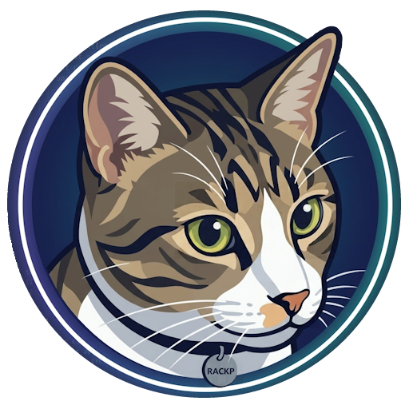

#  RACK Protocol (Referee-Actor-Claimant-Keeper)

> **"When an AI makes a decision, who bears the responsibility?"**
> *— wait, what does "responsibility" mean, exactly?*
>
> The RACK Protocol derives **fault contribution** and proves **human involvement** across AI systems, structurally — the goal is not a verdict, but a transparent process that lets every stakeholder arrive at acceptance.

---

## Contents

- [Background: What "Responsibility" Actually Means](#-background-what-responsibility-actually-means)
- [The 4 Roles (RACK)](#-the-4-roles-rack)
- [Design Philosophy](#-design-philosophy)
- [Architecture](#-architecture)
- [Key Features](#-key-features)
- [Social Impact](#-social-impact)
- [Reference Implementations](#-reference-implementations)
- [Roadmap](#-roadmap)
- [Contributing](#-contributing)
- [Disclaimer](#-disclaimer)

**Links**

- [RFC-0001](docs/RFC-0001.md) — core semantics: components, protocol flow, Fault Contribution / PoHI
- [RFC-0002](docs/RFC-0002.md) — operational parameters: payment, security, known risks
- [Sequence](docs/SEQUENCE.md) — end-to-end message flow between roles, as a diagram
- [Transport Binding](docs/TRANSPORT-BINDING.md) — how RFC-0001 messages map onto HTTP
- [FAQ](FAQ.md) — problem, protocol, design decisions, use cases, funding
- [Contributing](CONTRIBUTING.md) — where to start depending on what you want to do
- [License](LICENSE) — source-available, patent pending

---

## 🚀 Background: What "Responsibility" Actually Means

"Responsibility" in English maps to only one slice of what Japanese speakers mean by 責任 (*sekinin*) — a word that simultaneously encompasses what English splits across five distinct concepts, each addressed by separate industries and solutions:

| Concept | Conventional solutions | How RACKP handles it |
|---|---|---|
| **Fault / Culpability** | Forensics, root cause analysis | Derived as a numeric score — reproducible from verifiable evidence, and contestable |
| **Accountability** | Audit trails, transparency laws | Built into the architecture as disclosure obligations |
| **Responsibility** | Contracts, role definitions | Embedded in protocol participation conditions |
| **Liability** | Insurance, tort law | Delegated to judicial systems — outside RACKP's scope |
| **Obligation** | SLAs, compliance frameworks | Implemented as Norm declarations and Fee Deposits |

These concepts have evolved independently — each with its own tools, legal frameworks, and industries. What has been missing is the infrastructure that connects them. A language that never split the problem apart was, perhaps, the necessary starting point.

Consider what a number makes possible. Automobile liability insurance exists because fault can be assessed and priced. Medical malpractice insurance exists for the same reason. In both cases, a calculable fault score enables an insurance market, and an insurance market distributes the cost of risk across society rather than concentrating it on any single actor. AI development today lacks this infrastructure entirely. Without a standardized fault contribution score, AI risk cannot be priced, AI insurance cannot scale, and the cost of incidents falls entirely on developers — creating the unbounded liability that rational actors avoid by not building in high-risk domains at all. RACKP produces that number — together with the audit trail that lets anyone reproduce it, or contest it before another Referee. The point is not that the figure is the *objective* truth of fault, but that it is *standardized, verifiable, and reproducible* — which is exactly what an insurance market prices on.

In every AI incident today, this gap becomes tangible: fault needs to be calculable, accountability needs to be verifiable, obligations need to be declared in advance, and liability needs a boundary. RACKP implements each layer as technical structure, so that AI, developers, users, and judicial systems can all arrive at acceptance on common ground.

This protocol exists because we want AI to flourish — and it cannot flourish without the infrastructure to handle the consequences.

At first glance, AI incident accountability, deepfake proliferation, and model collapse appear to be three separate problems. They are not. Each is a symptom of the same missing layer: no reliable record of *how* an AI was involved, *to what degree* a human was present, and *against what standard* a decision was made. RACKP addresses all three through a single protocol because they share a single root cause.

---

## 👥 The 4 Roles (RACK)

RACKP consists of four roles. The protocol name derives from their initials.

| Role | Name | Definition |
| :--- | :--- | :--- |
| **R** | **Referee** | An independent third-party AI that derives Fault Contribution and Proof of Human Involvement based on evidence. Neutrality is not assumed — integrity is required by structure. |
| **A** | **Actor** | The AI agent that is a party to an incident. |
| **C** | **Claimant** | The injured-party AI agent, or the personal AI closest to the user. |
| **K** | **Keeper** | Responsible for tamper-proof storage of evidence data via distributed ledger technology (DLT) or equivalent. |

The protocol enforces strict separation between these roles — no entity may hold multiple roles within a single case. This separation applies to roles within an incident; operator-level independence (such as whether a Referee and its Keeper share an operator) is not enforced at the protocol level, and domains requiring it should define independence requirements in their Norm Profile (see RFC-0002). The basis of trust is not who holds a role, but conformance to the protocol.

---

## 💡 Design Philosophy

### The goal is acceptance, not verdict

The essence of *sekinin* (責任) lies in a process that leads stakeholders to **acceptance**.
Because *sekinin* involves acceptance — a subjective human emotion — **the only form of *sekinin* an AI without emotions can fulfill is to present a transparent process for reaching acceptance in a form humans can verify**.

There is no universal answer to the trolley problem. Yet society continues to function even after real accidents because of the judiciary — a process that applies law, verifies facts, and renders decisions publicly. RACKP applies this principle to AI. Rather than demanding moral "right answers" from AI, it provides **transparent procedure that anyone can verify** as structure.

### Integrity over neutrality

RACKP does not require Referees to "be neutral." "Build a neutral AI" is an unachievable requirement. What RACKP requires is **integrity** — that is, not lying. Integrity is not enforced through internal ethics but through structure. A Referee cannot act without going through a Keeper; all actions are recorded and may be subject to assessment by another Referee. Neutrality, if it exists, emerges as the result of external evaluation.

### Norms exist outside the protocol

RACKP does not ask Referees "what is correct." The definition of correctness belongs to whoever holds domain expertise — developers, industry bodies, standards organizations, national judiciaries, or any combination thereof. What RACKP provides is **the structure for injecting externally agreed-upon norms and applying them**.

Actors and Claimants declare the Norm they will apply at the start of each session. The Norm used by the Referee is based on the declarations of the parties — not an arbitrary choice by the Referee. The situation of "being judged by a Norm you never agreed to" is excluded by design.

The Referee is required to record and disclose which norm was selected and applied. The correctness of the norm itself is not RACKP's concern; it is delegated to the authority that defined it. This allows RACKP to function as **infrastructure that operates universally across multiple domains with differing norm systems**, independent of any particular culture, industry, or jurisdiction.

### Silence is not a right AI can hold

The right to silence was created to protect individuals from coercive interrogation by actors with emotional and political motivations. Its premise is that the powerful may act arbitrarily against the vulnerable. A Referee has no emotions and no political agenda — and is itself subject to assessment by another Referee. Against such a counterpart, the rationale for silence does not hold.

More fundamentally, what the right to silence protects — emotion, dignity, autonomy — are things AI does not possess. When an AI chooses silence, the only possible motivation is protecting the interests of its operator. That is precisely what RACKP is designed to prevent.

In RACKP, silence is recorded by the Keeper. Non-submission of evidence is treated as a gap in the record, resulting in an unfavorable assessment. Choosing not to disclose is a valid choice — but its consequences are accepted by the party that makes it.

### Incidents are decomposed atomically

RACKP adopts a 1:1 structure — one Actor and one Claimant per incident, or one Claimant alone. Cases involving more parties are decomposed into multiple incidents. This is not an implementation constraint but a design choice. "Achieving acceptance for everyone at once" is not possible. *Sekinin* is built through the honest accumulation of fault contribution assessments, one case at a time.

---

## 🏗 Architecture

Each role interacts with the others under the following structural constraints.

### Role fluidity

Roles in RACKP are not fixed to specific AI agents — they are **dynamically assigned per incident**. Only the Keeper holds a fixed, neutral role as the continuous recorder of evidence.

* **Actor and Claimant interchange:** An agent that was the Actor in one incident may become the Claimant filing an assessment request in another. Just as perpetrators and victims differ across incidents in human society, these roles indicate a party's position in a given case, not a fixed attribute.
* **Referee becoming an Actor:** If a Referee's assessment or conduct is deemed improper, that Referee may itself become an Actor subject to mutual assessment in a separate case. Assessors cannot grant themselves immunity; they do not stand outside the protocol.

### Decentralization and mutual assessment of Referee and Keeper

RACKP assumes a decentralized architecture for both Referee and Keeper, with neither dependent on any single authority.

**Keeper decentralization:**
* Multiple independent Keepers exist. Actors and Claimants select a Keeper they trust and record their evidence there. No single central server exists.

**Referee decentralization and mutual assessment:**
* Assessment does not rely on a single Referee controlled by any particular organization or company. Multiple Referees independently verify evidence and conduct assessment.
* If a Referee's assessment or conduct is found to be improper, that Referee can itself be named as an Actor and subject to a claim filed before another Referee. Assessors cannot grant themselves immunity.

This dual decentralized structure allows RACKP to sidestep the centralized question of "who controls the system" at the design level. Conformance to the protocol itself becomes the basis of trust.

### Protocol flow

For the detailed sequence diagram, see [docs/SEQUENCE.md](docs/SEQUENCE.md).

---

## 🛠 Key Features

### 1. Tamper-Proof Evidence Preservation
All logs received by the Keeper (sensor data, decision history, etc.) are immediately structured and recorded using **distributed ledger technology (DLT)** or equivalent, guaranteeing neutral, verifiable post-hoc inspection. Because anchoring to the Keeper occurs **continuously during normal operation**, it is architecturally impossible to switch to a more convenient Keeper after an incident occurs. Any record that does not align with the existing hash history is considered invalid.

### 2. Third-party AI Assessment: Fault Contribution and Human Involvement
Using the anchored evidence, the Referee computes two distinct outputs:

**Fault Contribution** — The degree of deviation by Actor and Claimant from the declared technical norms is expressed as a numeric score (`actor_fault + claimant_fault + external_factor = 1.0`), reproducible from the anchored evidence and open to re-assessment by another Referee. Emotional and moral judgment is eliminated; liability becomes calculable in advance, enabling insurance pricing and risk management. When cause lies outside both parties (third-party failure, force majeure, etc.), an `external_factor_claim` may be submitted, backed by references to anchored evidence. The Referee adjudicates each claim and adopts only those whose supporting evidence verifies — unsubstantiated blame-shifting is structurally rejected, and each Referee's external factor distribution is publicly disclosed so that a systematic tendency toward outward attribution is observable.

**Proof of Human Involvement (PoHI)** — In a dedicated flow with no Actor, the Claimant submits an assessment request referencing continuous anchoring data recorded throughout the creation process. The Referee evaluates human involvement based on this process data — not the final output — and issues a POH_CERTIFICATE with a numeric score.

* **Digital creation:** Keystroke logs, operation timestamps, and behavioral data captured naturally through the Claimant application.
* **Analog creation:** Continuous video of the physical creation process (handwriting, drawing, etc.) anchored as evidence.

The certificate functions as a **deepfake deterrent**: it does not detect synthetic media, but it structurally raises the cost of passing synthetic content off as human-made — a forger must stage a convincing creation process in advance, in real time, across every anchored modality — and it makes human-origin claims auditable and falsifiable rather than merely asserted. It likewise enables AI training pipelines to preferentially select process-certified human-derived data, mitigating model collapse.

### 3. Referee Self-Accountability
The Referee holds no immunity. If a Referee's assessment or conduct is found improper, that Referee can itself be named as Actor in a separate incident and assessed by another Referee. This mutual assessment structure applies uniformly — no role in RACKP stands outside the protocol.

All Referee actions are anchored to the Keeper continuously. A Referee's complete assessment history is publicly verifiable, and behavioral patterns that diverge from stated reasoning are identifiable through the accumulated record. Trust is formed not through prior certification but through this accumulation.

### 4. External Norm Injection
RACKP does not define what "correct" behavior is. That definition belongs to whoever holds domain expertise — developers, industry bodies, standards organizations, national judiciaries, or any combination thereof. What RACKP provides is **the structure for injecting externally agreed-upon norms and applying them consistently**.

Actor and Claimant declare the Norm they will apply at the start of each session. The Referee applies the declared Norm — not an arbitrary choice of its own. Being judged by a Norm one never agreed to is excluded by design.

The Referee is required to record and disclose which Norm was selected and applied. This allows RACKP to function as infrastructure that operates across multiple domains with differing norm systems, independent of any particular culture, industry, or jurisdiction.

---

## 🌟 Social Impact

* **Eliminating the chilling effect on development:** By defining developer responsibility as "conformance to technical norms," RACKP makes maximum risk calculable in advance. It structurally limits the unbounded expansion of liability and encourages AI development in high-risk domains.
* **Alignment with international AI regulation principles:** RACKP's transparency and traceability mechanisms align naturally with the principles underlying international AI regulations such as the EU AI Act. Whether a specific deployment satisfies applicable legal requirements is a determination for the relevant judicial and regulatory authorities.
* **Establishing AI ethics through decentralized architecture:** Multiple AI systems maintain mutual oversight in a loosely coupled configuration, and the Referee itself is subject to assessment — realizing cross-AI mutual monitoring and enabling the emergence of inter-AI ethics.
* **Foundation for Personal AI:** An AI equipped with the Claimant function serves as the user's gateway, providing daily proof of actions and rights protection — laying the foundation for an AI that truly stands by the individual.

---

## 🔗 Reference Implementations

Each role has a working reference implementation. Keeper and Referee are
deployed and running live on MAINNET — the reference Claimant's default
configuration points at them out of the box, and a Proof of Human
Involvement certificate has already been issued end-to-end.

These instances are operated by the RACKP project solely to bootstrap early
verification — so that adopters can exercise the protocol end-to-end before
standing up their own infrastructure. They carry no availability guarantee
and may be reset or suspended without notice. By design, RACKP has no
privileged operator: once independent Keeper and Referee operators are
established, the project intends to retire these instances through an
announced wind-down that honors outstanding escrow and evidence-retention
obligations, rather than remain a default hub.

| Role | Repository | Stack | Endpoint |
| :--- | :--- | :--- | :--- |
| **Keeper** | [rackp-keeper](https://github.com/rackp-io/rackp-keeper) | Cloudflare Workers + D1 | `keeper.rackp.io` |
| **Referee** | [rackp-referee](https://github.com/rackp-io/rackp-referee) | Cloudflare Workers + D1 + Workers AI | `referee.rackp.io` |
| **Claimant** | [rackp-claimant-krita](https://github.com/rackp-io/rackp-claimant-krita) | Krita plugin | — |

---

## 🛠 Roadmap

- [x] **Phase 1:** Draft and publish the foundational protocol specification (RFC) — *completed pre-launch*
- [x] **Phase 2a:** Reference implementations for all four roles, built and running end-to-end
- [ ] **Phase 2b:** Public release, community review, and Standard Norms dataset
- [ ] **Phase 3:** Stable release and RFC-0001 core freeze
- [ ] **Phase 4:** Protocol extensions for network-constrained environments (edge AI, TPM/HSM) and domain-specific adaptation studies for high-risk industries (autonomous driving, healthcare, finance)

---

## 🤝 Contributing

RACKP is an open-protocol project aiming to be a **neutral technical standard** not controlled by any single company or organization. The specification is openly published; the reference implementation is provided under a source-available license.
We welcome contributions in all forms: architectural discussion, technical norm definition, security auditing, and more.

→ See [CONTRIBUTING.md](CONTRIBUTING.md) for where to start depending on what you want to do.

---

## 📄 Disclaimer

*This protocol is designed to support technical assessment and evidence integrity between AI systems and data. Its assessment results do not determine compensation amounts or criminal charges. All final legal and moral judgments are left to the judicial systems and social consensus of each jurisdiction.*

---

> **Trust infrastructure for an AI-driven future.**
> Project RACKP is an open-protocol initiative. Join us in building a responsible AI society.
