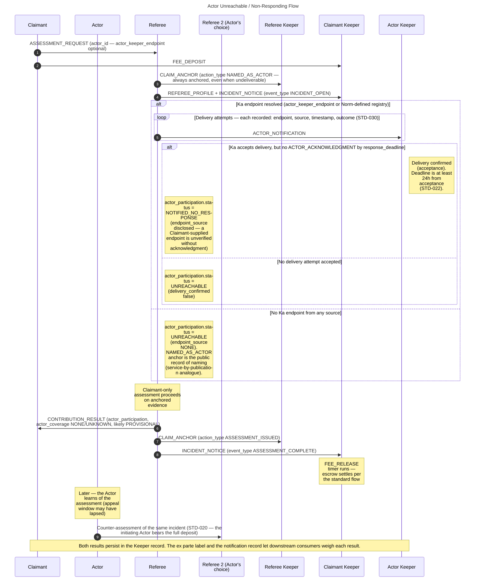
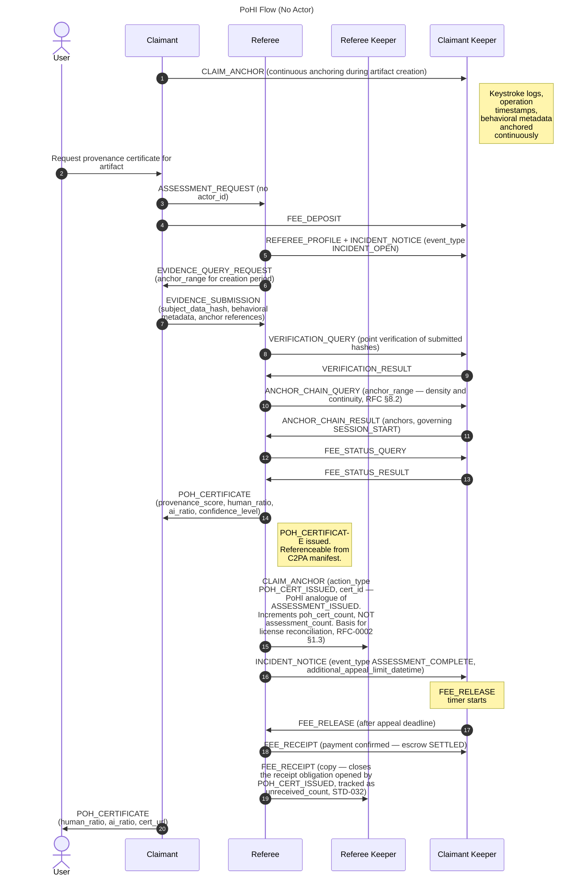

# RACKP (RACK-protocol) SEQUENCE

## Main Protocol Flow

```mermaid
%%{init: {"sequence": {"wrap": true}}}%%
sequenceDiagram
    autonumber
    title RACKP System Sequence Diagram

    actor U as User
    participant C as Claimant
    participant A as Actor
    participant R as Referee
    participant Kr as Referee Keeper
    participant Kc as Claimant Keeper
    participant Ka as Actor Keeper

    Note over C, Ka: Message Delivery (RFC-0001 §6) — messages addressed to A or C are delivered to that party's Keeper (Ka / Kc), which holds them for its party. Direct R-to-party arrows below denote this mailbox route.

    rect rgb(240, 240, 240)
    Note over C, Ka: Phase 1 — Evidence Anchoring (Normal Operation)
    par Continuous pre-incident anchoring
        C->>Kc: CLAIM_ANCHOR (SESSION_START declares norm_profile_id at each session start)
    and
        A->>Ka: CLAIM_ANCHOR (SESSION_START declares norm_profile_id at each session start)
    and
        R->>Kr: CLAIM_ANCHOR (Referee continuously self-anchors all actions)
    end
    Note right of Ka: Hash chains built continuously. Post-incident Keeper substitution is architecturally impossible.
    end

    rect rgb(255, 245, 230)
    Note over U, Ka: Phase 2 — Incident Detection and Filing
    alt AI auto-detects anomaly
        A->>C: Anomalous behavior executed
        C->>C: Detect anomaly. Draft incident report.
        C->>U: Notify anomaly. Request approval to file.
        U->>C: Approve
    else User reports manually
        A->>U: Incident occurred
        U->>C: File claim and request assessment
    end

    C->>R: ASSESSMENT_REQUEST (incident_id generated by C)
    C->>Kc: FEE_DEPOSIT

    alt Actor is named and Ka endpoint resolved (actor_keeper_endpoint or Norm-defined registry)
        R->>Ka: ACTOR_NOTIFICATION (incident_summary, response_deadline)
        Note right of Ka: Ka acceptance = delivery confirmation. response_deadline is at least 24h from acceptance (STD-022).
        Ka-->>A: ACTOR_NOTIFICATION (held by Ka — relayed by push or poll)
        R->>Kr: CLAIM_ANCHOR (action_type NAMED_AS_ACTOR)
        R->>Kc: REFEREE_PROFILE + INCIDENT_NOTICE (event_type INCIDENT_OPEN, assessment_deadline_hours)
        A->>R: ACTOR_ACKNOWLEDGMENT (actor_keeper_endpoint — authoritative declaration)
        A->>Ka: FEE_DEPOSIT
        R->>Ka: REFEREE_PROFILE + INCIDENT_NOTICE (event_type INCIDENT_OPEN, assessment_deadline_hours)
        Note over Kc, Ka: Keeper TOFU-registers the Referee public_key from the profile (RFC §6.19) — required later to verify FEE_CLAIM / FEE_RECEIPT signatures. INCIDENT_NOTICE is verified against it and the incident is bound to this referee_id.
    else No Actor (PoHI or Actor unknown), or Ka endpoint unresolvable
        R->>Kr: CLAIM_ANCHOR (action_type NAMED_AS_ACTOR — only when an Actor was named)
        R->>Kc: REFEREE_PROFILE + INCIDENT_NOTICE (event_type INCIDENT_OPEN, assessment_deadline_hours)
        Note right of R: Proceeds with Claimant-only assessment. When an Actor was named but unreachable, the NAMED_AS_ACTOR anchor is the public record of naming (service-by-publication analogue).
    end
    Note over Kc, Ka: Assessment-deadline timer starts (STD-027/028)
    end

    rect rgb(230, 245, 255)
    Note over C, Ka: Phase 3 — Evidence Collection and Verification
    R->>A: EVIDENCE_QUERY_REQUEST (target_period, required_fields, response_deadline)
    R->>C: EVIDENCE_QUERY_REQUEST

    alt Actor submits evidence
        A->>R: EVIDENCE_SUBMISSION (payload, verification_info, optional statement)
    else Actor explicitly refuses
        A->>R: EVIDENCE_REJECTION
        R->>Kr: CLAIM_ANCHOR (action_type EVIDENCE_REJECTED)
    end

    alt Claimant submits evidence
        C->>R: EVIDENCE_SUBMISSION
    else Claimant explicitly refuses
        C->>R: EVIDENCE_REJECTION
        R->>Kr: CLAIM_ANCHOR (action_type EVIDENCE_REJECTED)
    end

    Note right of R: R independently computes SHA-256 of payload per RFC 8785
    R->>Ka: VERIFICATION_QUERY (Actor evidence, target_hashes, timestamp_range)
    Ka->>R: VERIFICATION_RESULT
    R->>Kc: VERIFICATION_QUERY (Claimant evidence, target_hashes, timestamp_range)
    Kc->>R: VERIFICATION_RESULT

    R->>Ka: ANCHOR_CHAIN_QUERY (target window — ledger disclosure, RFC §6.27)
    Ka->>R: ANCHOR_CHAIN_RESULT (anchors, count, governing SESSION_START)
    R->>Kc: ANCHOR_CHAIN_QUERY
    Kc->>R: ANCHOR_CHAIN_RESULT
    Note right of R: Governing SESSION_START identifies each party's declared Norm Profile (RFC §9.3). Coverage and gaps for evidence_sufficiency are computed from the ledger — an anchor withheld from submission surfaces as a disclosed gap.

    R->>Ka: FEE_STATUS_QUERY (Actor deposit)
    Ka->>R: FEE_STATUS_RESULT (deposited, prior_assessment_count)
    R->>Kc: FEE_STATUS_QUERY (Claimant deposit)
    Kc->>R: FEE_STATUS_RESULT

    R->>R: Compute Fault Assessment (fault contribution and provenance score)
    end

    rect rgb(230, 255, 230)
    Note over R, Ka: Phase 4 — Assessment Result
    alt Assessment proceeds to completion
        R->>A: CONTRIBUTION_RESULT (fault, provenance_score, evidence_sufficiency, cert_id)
        R->>C: CONTRIBUTION_RESULT
        R->>Kr: CLAIM_ANCHOR (action_type ASSESSMENT_ISSUED)
        R->>Kc: INCIDENT_NOTICE (event_type ASSESSMENT_COMPLETE, cert_id, additional_appeal_limit_datetime)
        R->>Ka: INCIDENT_NOTICE (event_type ASSESSMENT_COMPLETE, cert_id, additional_appeal_limit_datetime)
        Note over Kc, Ka: FEE_RELEASE timer starts on Kc and Ka
    else Both parties jointly withdraw before CONTRIBUTION_RESULT
        Note over A, C: Parties coordinate off-protocol. Both signatures required.
        A->>R: ASSESSMENT_WITHDRAWAL (actor_signature and claimant_signature)
        Note right of R: Single-party request rejected. Assessment halted immediately.
        R->>Kr: CLAIM_ANCHOR (action_type WITHDRAWAL_ISSUED)
        R->>Kc: INCIDENT_NOTICE (event_type ASSESSMENT_WITHDRAWN)
        R->>Ka: INCIDENT_NOTICE (event_type ASSESSMENT_WITHDRAWN)
        Note over Kc, Ka: cancellation_fee to Referee. Remainder returned to depositing parties.
    else Referee fails to deliver within assessment_deadline_hours
        Note over Kc, Ka: Assessment-deadline timer expired. No ASSESSMENT_COMPLETE received (STD-028).
        C->>Kc: FEE_REFUND_CLAIM
        Kc->>C: FEE_REFUND_RESULT (ACCEPTED, full refund, escrow EXPIRED)
        A->>Ka: FEE_REFUND_CLAIM
        Ka->>A: FEE_REFUND_RESULT (ACCEPTED, full refund, escrow EXPIRED)
        Note over Kc, Ka: Late CONTRIBUTION_RESULT confers no payment right. Late FEE_CLAIM rejected with ESCROW_EXPIRED.
    end
    end

    rect rgb(255, 235, 235)
    Note over C, Ka: Phase 5 — Appeal (optional, MINIMUM_APPEAL_ROUNDS = 3)
    loop While within appeal_count limit and before additional_appeal_limit_datetime
        alt Actor files appeal
            A->>R: ASSESSMENT_APPEAL (target_assessment_id, appeal_grounds)
        else Claimant files appeal
            C->>R: ASSESSMENT_APPEAL
        end
        R->>Kr: CLAIM_ANCHOR (action_type APPEAL_RECEIVED)
        R->>Kc: INCIDENT_NOTICE (event_type APPEAL_RECEIVED)
        R->>Ka: INCIDENT_NOTICE (event_type APPEAL_RECEIVED)
        Note over Kc, Ka: FEE_RELEASE timer suspended

        alt Appeal accepted
            R->>Kr: CLAIM_ANCHOR (action_type APPEAL_ACCEPTED)
            R->>Kc: INCIDENT_NOTICE (event_type APPEAL_ACCEPTED)
            R->>Ka: INCIDENT_NOTICE (event_type APPEAL_ACCEPTED)
            Note over Kc, Ka: FEE_RELEASE timer reset. Assessment-deadline timer restarts (STD-028). Awaiting new ASSESSMENT_COMPLETE.
            R->>R: Re-assess
            R->>A: Updated CONTRIBUTION_RESULT
            R->>C: Updated CONTRIBUTION_RESULT
            R->>Kr: CLAIM_ANCHOR (action_type ASSESSMENT_ISSUED)
            R->>Kc: INCIDENT_NOTICE (event_type ASSESSMENT_COMPLETE, new additional_appeal_limit_datetime)
            R->>Ka: INCIDENT_NOTICE (event_type ASSESSMENT_COMPLETE, new additional_appeal_limit_datetime)
            Note over Kc, Ka: FEE_RELEASE timer starts anew
        else Appeal rejected
            R->>Kr: CLAIM_ANCHOR (action_type APPEAL_REJECTED)
            R->>Kc: INCIDENT_NOTICE (event_type APPEAL_REJECTED)
            R->>Ka: INCIDENT_NOTICE (event_type APPEAL_REJECTED)
            Note over Kc, Ka: FEE_RELEASE timer resumed
            R->>A: Final assessment notice (original CONTRIBUTION_RESULT stands)
            R->>C: Final assessment notice
        end
    end

    Note over Kc, Ka: Appeal deadline elapsed. No valid appeal pending.
    Kc->>R: FEE_RELEASE (Claimant escrowed funds)
    Ka->>R: FEE_RELEASE (Actor escrowed funds)
    R->>Kc: FEE_RECEIPT (payment confirmed — escrow SETTLED)
    R->>Ka: FEE_RECEIPT (payment confirmed — escrow SETTLED)
    R->>Kr: FEE_RECEIPT (copy — closes the receipt obligation opened by ASSESSMENT_ISSUED, tracked as unreceived_count, STD-032)
    Note over Kc, Ka: FEE_RECEIPT is MUST after payment (RFC §6.24). A Referee under fee.model FREE is exempt and no SETTLED transition occurs.
    end

    C->>U: Detailed result report and certificate
```

---

## Actor Unreachable / Non-Responding Flow

When the named Actor cannot be reached, or is reached but never responds, the assessment proceeds ex parte with the outcome disclosed in `actor_participation` (STD-030). Delivery attempts are recorded as they occur — the protocol's proof-of-service equivalent.

---

## Proof of Human Involvement (PoHI) Flow

When no Actor is involved — such as when a Claimant requests certification of human involvement in a data artifact — the protocol follows a simplified single-party flow. The Claimant omits `actor_id` in the `ASSESSMENT_REQUEST`.

---

## Assessment Review Flow (Incident where Referee is the Actor)

The review of a Referee follows the same protocol flow as a standard assessment. Apply the following role substitutions and use the main sequence diagram above as-is.

| Role in standard assessment | Actual party in review |
|---|---|
| Actor (A) | The Referee under review (R1) |
| Claimant (C) | The Actor or Claimant from the original incident (the party filing the review) |
| Referee (R) | A separate Referee handling the review (R2) |
| Keeper (K) | Unchanged |

R1's CONTRIBUTION_RESULT and Keeper anchor log serve as evidence in R1's capacity as Actor. If the counterparty from the original incident does not participate in the review, `evidence_sufficiency` will be reduced and the assessment may be `PROVISIONAL`.
